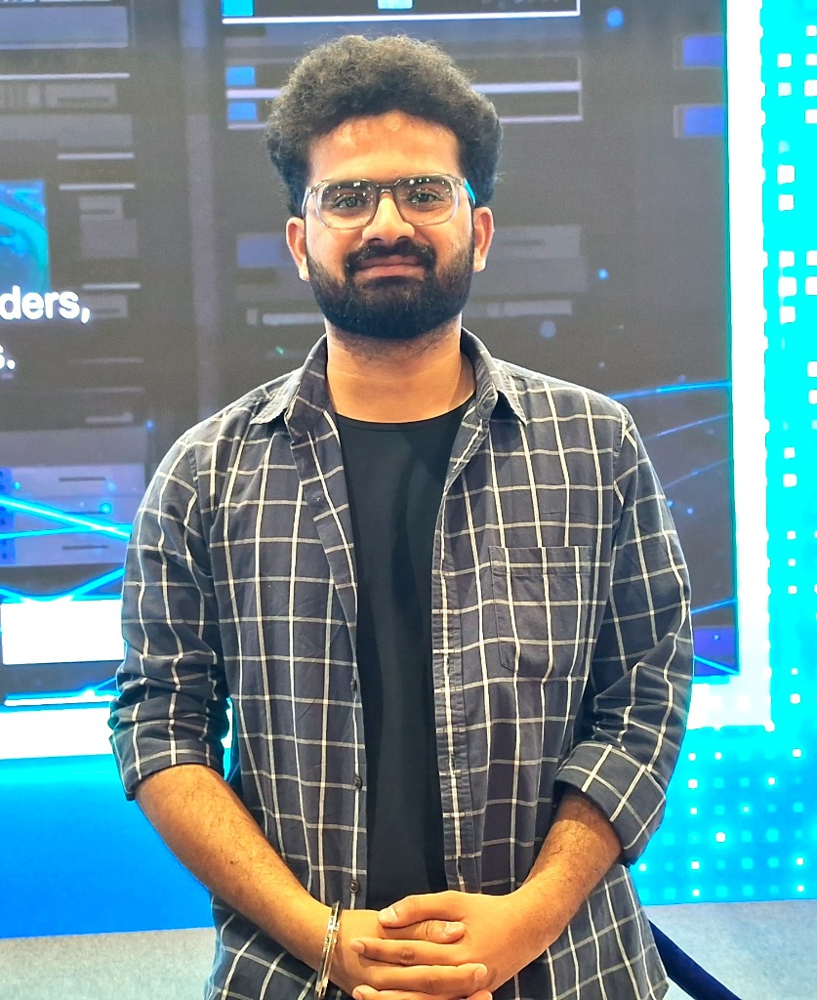

# 🚀 KUSH.DEV — Space-Themed Developer Portfolio

> An interactive, space-themed developer portfolio built with React, Three.js, and Framer Motion.



## ✨ Features

### 🌌 Immersive Space Theme
- **Starfield Background** — Procedurally generated 2000+ particle stars with Three.js
- **Nebula Gradients** — Multi-layer cosmic background effects
- **Shooting Stars** — Animated shooting star particles
- **Cursor Trail** — Glowing particle trail that follows your cursor

### 🧑‍🚀 3D Interactive Astronaut
- Procedurally generated astronaut character with Three.js primitives
- Idle floating animation with subtle rotation
- Glowing visor with shimmer effect
- Decorative planets with orbital rings

### 🎨 Premium Design
- **Glassmorphism** — Frosted glass card effects throughout
- **Neon Accents** — Purple/Blue/Cyan glow effects
- **Smooth Animations** — Framer Motion scroll reveals and transitions
- **Loading Screen** — Animated progress bar on initial load
- **Custom Typography** — Orbitron (headings) + Inter (body) from Google Fonts

### 📱 Responsive & Performant
- Mobile-first responsive design
- 3D optimized for mobile (reduced particles, simplified scene)
- Lazy rendering with intersection observer

### 🤖 AI Chat Assistant
- Pre-programmed Q&A about skills, projects, and experience
- Suggested questions for quick access
- Typing animation and markdown-like bold formatting
- Floating chat bubble with pulse animation

## 🛠 Tech Stack

| Technology | Purpose |
|-----------|---------|
| React 18 | UI Framework |
| Vite 6 | Build Tool |
| Three.js | 3D Graphics |
| @react-three/fiber | React Three.js integration |
| @react-three/drei | Three.js helpers |
| Framer Motion | Animations |
| Tailwind CSS 3 | Styling |
| React Icons | Iconography |

## 📦 Getting Started

### Prerequisites
- Node.js 18+
- npm or yarn

### Installation

```bash
# Clone the repository
git clone https://github.com/kush/devfolio.git
cd devfolio

# Install dependencies
npm install

# Start development server
npm run dev
```

The app will open at `http://localhost:3000`

### Build for Production

```bash
npm run build
npm run preview
```

## 📁 Project Structure

```
src/
├── components/
│   ├── chat/           # AI Chat Assistant
│   ├── layout/         # Navbar, Footer
│   ├── sections/       # Hero, About, Skills, Projects, Experience, Education, Contact
│   └── three/          # Starfield, Astronaut (3D components)
├── data/               # Resume, projects, skills data
├── hooks/              # Custom React hooks
├── styles/             # Global CSS
├── App.jsx             # Main app component
└── main.jsx            # Entry point
```

## 🎨 Customization Guide

### 1. Update Personal Data
Edit the files in `src/data/`:
- `resume.js` — Your name, about text, experience, education, links
- `projects.js` — Your project details with descriptions and metrics
- `skills.js` — Your skills organized by category with proficiency levels

### 2. Change Profile Images
Replace images in `public/images/`:
- `profile1.jpg` — Hero/casual photo
- `profile2.jpg` — Professional photo (used in About section)

### 3. Customize Theme Colors
Edit `tailwind.config.js` to change:
- Space background colors
- Nebula accent colors
- Star/glow colors

### 4. Update Links
In `src/data/resume.js`, update the `links` object with your:
- GitHub URL
- LinkedIn URL
- Email address
- Resume PDF path

## 🚀 Deployment

### Vercel (Recommended)
```bash
npm install -g vercel
vercel
```

### Netlify
```bash
npm run build
# Upload `dist/` folder to Netlify
```

## 📄 License

This project is open source and available under the [MIT License](LICENSE).

---

Built with ☕ and 🚀 by **Kush**
